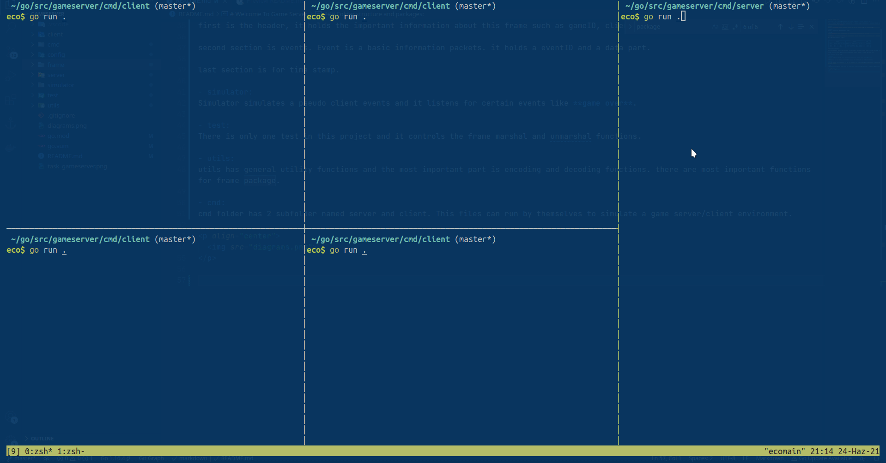
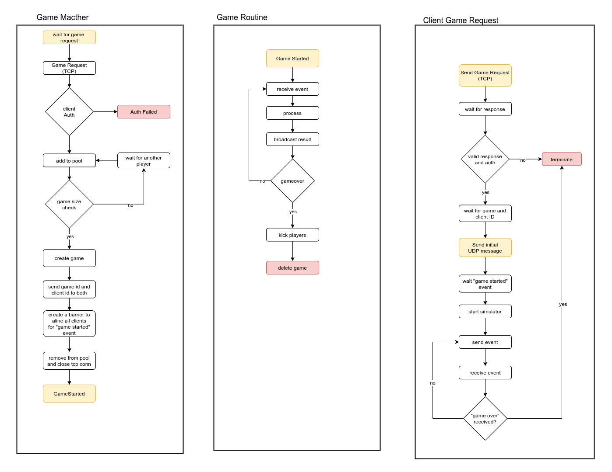

# Game Server 

**Attention. This is an assignment project and it's gonna be public for a brief period of time.**

This is a "simple" game server. Main functionalities are matching and establishing a connection between players

## How to Run?

run the **server.go** with **go run .** under **/cmd/server/**

and run as many client as you want (kidding, go easy :) ).

client file is under **/cmd/client/** you can run it with **go run .** to.

## Folder Structure and Packages:

- **/server**:
Server is main package of this project it contains the code for matching (TCP) and connection(UDP)

- **/client**:
Client is an abstract representation of player.

- **/config**:
Config package hold server configurations such as connection information, game size etc.

- **/frame**:
Frame package is a data frame package. It developed **just for this project** and It is a serializer for a game events.

detailed frame information is in below.

```
|------------------------------------|-----------------------------------------|-----------|
|                header              |                events...                |  time     |
|------------------------------------|------------------------------------------------------
|clientID | gameID | number of event | eventID  |  data | eventID  |  data |...| timeStamp |
|------------------------------------|------------------------------------------------------
|  2byte  | 2byte  |     1byte       |   1byte  | 4byte |   1byte  | 4byte |...|   8byte   |
|  16bit  | 16bit  |     8bit        |   8bit   | 32bit |   8bit   | 32bit |...|   64bit   |
|------------------------------------|-----------------------------------------|-----------|
```
frame contains **3** section.

first is the **header**, it holds the important information about this frame such as gameID, clientID and number of event.

second section is **events**. Event is a basic information packets. it holds a eventID and a data part.

last section is for **time stamp**.

- **/simulator**:
Simulator simulates a pseudo client events and it listens for certain events like **game over**.

- **/test**:
There is only one test in this project and it controls the frame marshal and unmarshal functions. 

- **/utils**:
utils has general utility functions and the most important part is encoding and decoding functions. there are most important functions for frame package.

- **/cmd**:
cmd folder has **2** subfolder named server and client. This files can run by themselves to simulate a game server/client environment. 

there is a demonstration of client and server.

<p align="center">
  
</p>

## Server Work Flow

### Game Matcher

Mather is using **TCP** connections to receive game requests.

After a game request has arrived matcher is adding that use to a queue. if there is enough participant in the queue, matcher groups them under a gameID and attaches this group to **the gameList**.

After adding group to **the gameList** it removes players from **the gameQueue** and closes their TCP connections.

*Game size can be change from **/config** directory.


### Game Routine

Game routine listens **UDP** packets. First it needs a **register** request from client attached with game and client ID.

When register arrive game routine start to reads and process incoming data and send back to clients.

*Game routine is schedules a dummy **game over** routine to test if games are lasting properly. Max and min game times are configurable from /config directory.

### Client Game Request

Client send a initial message that contains a "token" if token is valid (and there is enough participant to create a game of course) server responds it with a gameID and clientID.

Client uses those information to send a initial UDP register message.

Client waits for **game started** event and send a pseudo random events to other server.

When **game over** event has arrived client ends its process.

*event sending and receiving functions are not serial functions. they are running concurrently

<p align="center">
  
</p>

### Notes

- To avoid ip:port collision evet client open its UDP listen port differently. for example client 3's UDP port is 9093(9090+3)

- There is also a dummy non-functional authentication system. it is like a placeholder for better authentication and authorization systems.

- There is an easy interrupt handle for client and server. If server interrupted with SIGINT, SIGTERN or SIGQUIT it send a **disconnected** event to server and server broadcasts a **game over** event to all players. Likewise If server interrupted it send the same **game over** event to all players in all games.


I wish to deliver this assignment sooner but my workload was pretty intens this week.

Thank you for sending me this assignment, it was very fun and honestly it reminds me the times when I used to write code just for fun.
